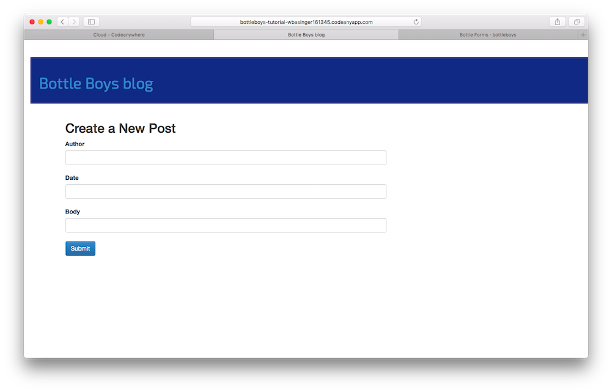
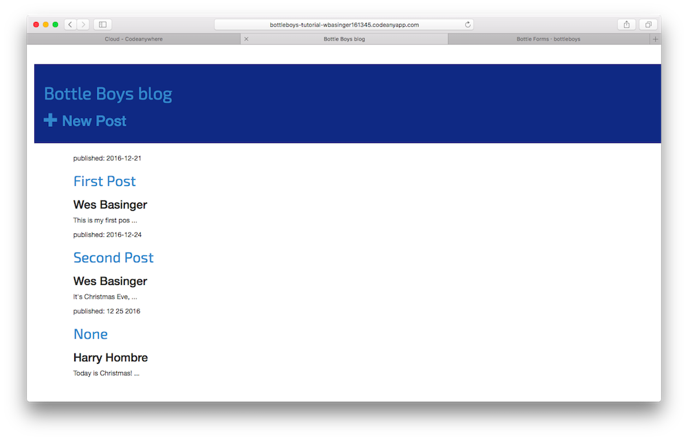

# Bottle Forms

The final thing we want to do on our website is create a nice way to add and edit blog posts. So far, we can only view existing posts.  If we wanted new entries, we would have to edit the JSON file, and that's pretty cumbersome.  With forms we will have absolute power over our interface – we can do almost anything we can imagine!

We'll have to build this all from scratch, and it's going to take several new routes and learning some new HTTP methods.  Let's start with the easiest part, let's build a template for the HTML form.  Start a new file called `new.html` in `views`.

views/new.html
```html
% include("header.html")
        <div class="content container">
          <div class="row">
              <div class="col-md-8">
                <h2>Create a New Post</h2>
                <div class="form-group">
                <form action='/new' method="POST">
                  <label for="author">Author</label>
                  <input type="text" required="yes" name="author" class="form-control"></input><br>
                  <label for="title">Title</label>
                  <input type="text" required="yes" name="title" class="form-control"></input><br>
                  <label for="date">Date</label>
                  <input type="date" required="yes" name="date" class="form-control"></input><br>
                  <label for="body">Body</label>
                  <input type="textarea" required="yes" name="body" class="form-control"></input><br>
                  <button type="submit" class="btn btn-primary">Submit</button>
                </form>
                </div>
              </div>
          </div>
      </div>
% include('footer.html')
```

We won't be able to see our nice new form until we make a route for it.  So let's go to `app.py` and fix that.  Note the new methods that we are importing from `bottle` at the top of the file.

app.py
```python
from sys import argv
from bottle import route, run, template, static_file, get, post # This line is new!!!
from tinydb import TinyDB, Query
import os

@route('/')
def index():
  db = TinyDB("db.json")
  posts = db.table("posts")
  return template('index.html', posts=list(posts.all()))

@route('/about')
def about():
  return "This is the about me route."

@route('/blog/<post_number>')
def blog(post_number):
  db = TinyDB('db.json')
  posts = db.table('posts')
  Post = Query()
  blog = posts.get(Post.postId == post_number)
  return template('blog.html', blog=blog)

@get('/new')
def create_new():
  return template('new.html')

@route('/static/<filename>')
def server_static(filename):
    cwd = os.getcwd()
    return static_file(filename, root=cwd + "/static")

run(host="0.0.0.0", port=argv[1], debug=True)
```

If you run the server and visit [http://0.0.0.0:8080/new](http://0.0.0.0:8080/new), you can see the new shiny form you built.  



But if you try to fill it out and submit, you'll get a big fat error.  That's because the action is a POST route and we haven't defined that in `app.py` yet.  That's our next step.  Open up `app.py` and let's modify it again.  This time we'll add a post route.

app.py
```python
from sys import argv
from bottle import route, run, template, static_file, get, post, request, redirect # This line is new!!!
from tinydb import TinyDB, Query
import os

@route('/')
def index():
  db = TinyDB("db.json")
  posts = db.table("posts")
  return template('index.html', posts=list(posts.all()))

@route('/about')
def about():
  return "This is the about me route."

@route('/blog/<post_number>')
def blog(post_number):
  db = TinyDB('db.json')
  posts = db.table('posts')
  Post = Query()
  blog = posts.get(Post.postId == post_number)
  return template('blog.html', blog=blog)

@get('/new')
def create_new():
  return template('new.html')

@post('/new')
def post_new():
  author = request.forms.get('author')
  date = request.forms.get('date')
  body = request.forms.get('body')
  title = request.forms.get('title')
  db = TinyDB('db.json')
  posts = db.table('posts')
  new_post_id = posts.insert(
      {
        'author': author,
        'date': date,
        'body': body,
        'postId': "",
        'title' : title})
  posts.update({'postId': str(new_post_id)}, eids=[new_post_id])
  redirect('/')


@route('/static/<filename>')
def server_static(filename):
    cwd = os.getcwd()
    return static_file(filename, root=cwd + "/static")

run(host="0.0.0.0", port=argv[1], debug=True)
```

Now restart the server, go back and visit [http://0.0.0.0:8080/new](http://0.0.0.0:8080/new).  You should be able to write new blog posts with ease!

But instead of having to type in the `/new` part on the end of the address, let's modify the header file to include a new post link.  Open up `header.html`.

views/header.html
```html
<html>
    <head>
        <title>Bottle Boys Blog</title>
        <link rel="stylesheet" href="//maxcdn.bootstrapcdn.com/bootstrap/3.2.0/css/bootstrap.min.css">
         <link rel="stylesheet" href="//maxcdn.bootstrapcdn.com/bootstrap/3.2.0/css/bootstrap-theme.min.css">
         <link href="https://fonts.googleapis.com/css?family=Exo+2" rel="stylesheet">
         <link rel="stylesheet" href="/static/blog.css">
    </head>
    <body>
        <div class="page-header">
            <h1><a href="/">Bottle Boys Blog</a></h1>
            <a href="/new"><h2><span class="glyphicon glyphicon-plus"></span>New Post</h2></a>
        </div>
```

This is what I got when I finished...




## One more thing: deploy time!

Let's see if all this works on Heroku. Time for another deploy!

* First, commit your new code, and push it up to Github:

command-line
```
$ git status
$ git add --all .
$ git status
$ git commit -m "Added views to create/edit blog post inside the site."
$ git push
```

* Then:

command-line
```
$ git push heroku master
[...]
```

And that should be it! Congrats :)
