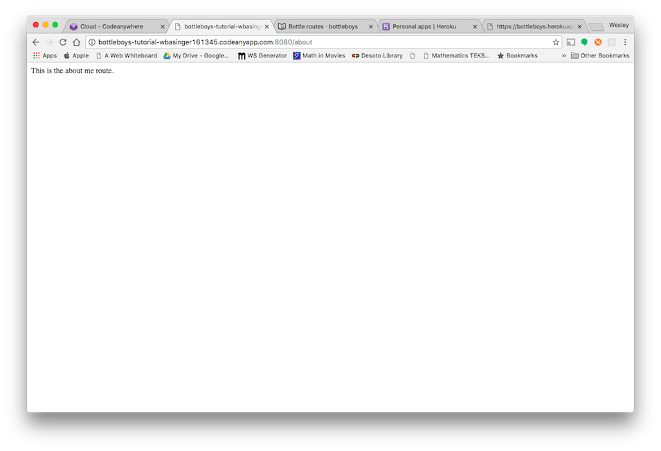

# Bottle Routes

We're about to build our first page: a landing site for your blog! But first, let's learn a little bit about Bottle routes.

## What is a Route?

A route is simply a web address. You can see a route every time you visit a website – it is visible in your browser's address bar. (Yes! `127.0.0.1:8000` is a URL! And `https://wesbasinger.github.io` is also a URL.)

Every page on the Internet needs its own route. This way your application knows what it should show to a user who opens that route. In Bottle we use something called a decorator function.  A decorator function basically will call another function with some magic behind the scenes.

## How do routes work in Bottle?

Let's open up the `app.py` file in your code editor of choice and see what it looks like:

app.py
```python
from sys import argv
from bottle import route, run

@route('/')
def index():
  return "Hello World: A Message in a Bottle App"

run(host="0.0.0.0", port=argv[1], debug=True)
```

That's exactly how we left it.  It's typical to name the home route as index, so we'll create another route for an about me page.  Modify the existing code so that it looks something like this...

app.py
```python
from sys import argv
from bottle import route, run

@route('/')
def index():
  return "This is the index route."

@route('/about')
def about():
  return "This is the about me route."

run(host="0.0.0.0", port=argv[1], debug=True)
```
Now fire up your server again with `python app.py 8080` and visit `0.0.0.0:8080/about`.  You should see the new route.  Bottle is smart enough to read the URL and send the reader where you want them to go!  There's a sample of how it should look below.



Bottle is even smart enough to read what are called parameters from the URL.  Let's stub out a route for individual blog posts.  Modify `app.py` like so.

app.py
```python
from sys import argv
from bottle import route, run

@route('/')
def index():
  return "This is the index route."

@route('/about')
def about():
  return "This is the about me route."

@route('/blog/<post_number>')
def blog(post_number):
  return "This is blog number " + post_number

run(host="0.0.0.0", port=argv[1], debug=True)
```
Now navigate to `0.0.0.0:8080/blog/10`.  It should say "This is blog number 10".  Bottle is reading the route parameter from the URL!  That is extremely helpful.  It allows us to pass information like variables between client and server.  There's a sample below of what you should see.


I think that's all we really need to cover for right now, but you should know that you can include multiple parameters in the route and do different types of requests to the same URL, as long as you change the route method.
