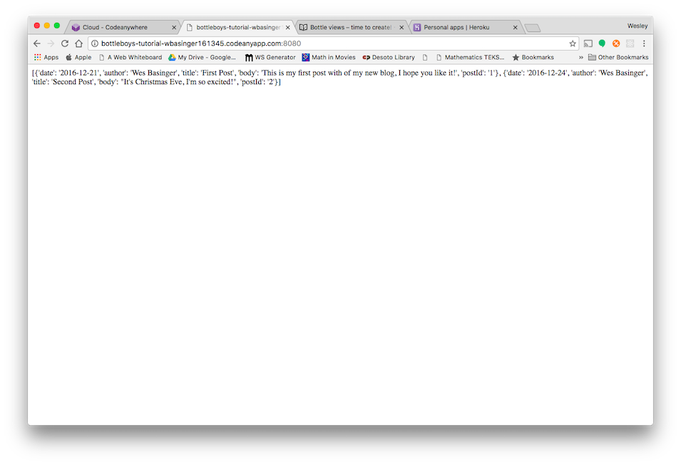

# Bottle views – time to create!

A *view* is a place where we put the "logic" of our application. It will request information from the database you created before and pass it to a `template`. We'll create a template in the next chapter. Views are just Python functions that are a little bit more complicated than the ones we wrote in the __Introduction to Python__ chapter.

Views are placed in the `app.py` file.  We will just add logic to the existing routes instead of returning plain text.

## app.py

We are going to write some code that will return all posts to us in the index route.  So instead of seeing Hello World: Message from Bottle App, we will see all the raw text data from the database file that we seeded earlier.  Modify the `app.py` in the following manner.

app.py
```python
from sys import argv
from bottle import route, run
from tinydb import TinyDB # This line is new!!!

@route('/')
def index():
  # ALL of this is new!!!
  db = TinyDB("db.json")
  posts = db.table("posts")
  return str(posts.all())

@route('/about')
def about():
  return "This is the about me route."

@route('/blog/<post_number>')
def blog(post_number):
  return "This is blog number " + post_number

run(host="0.0.0.0", port=argv[1], debug=True)
```

Now run the server and visit the homepage of your web app.  You'll see all the data.  It's not pretty, but we'll do something about that in the next section.  For now, be happy we know how to retrieve data!  I've include a sample below of how it should look.


