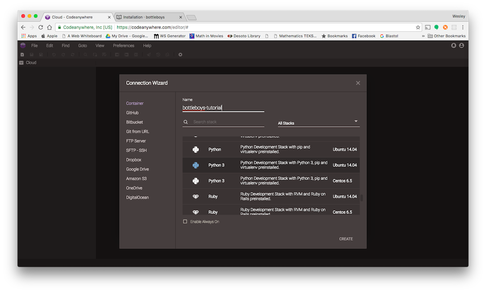
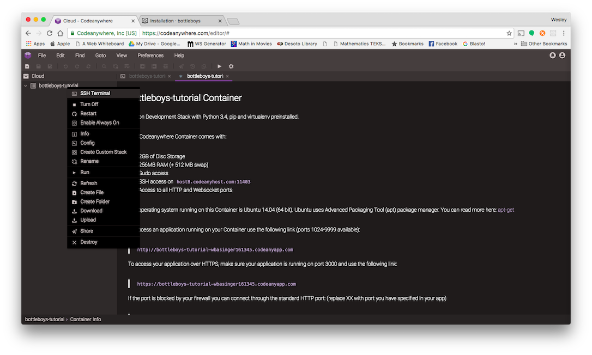

You can [skip right over this section](http://tutorial.djangogirls.org/en/installation/#install-python) if you are going to develop locally on your own machine. If you
are, your installation experience will be a little different. You can ignore the
rest of the installation instructions.

### CodeAnywhere

CodeAnywhere is a tool that gives you a code editor and access to a computer running
on the Internet where you can install, write, and run software. For the duration
of the tutorial, CodeAnywhere will act as your _local machine_. You'll still be
running commands in a terminal interface just like your classmates on OS X,
Ubuntu, or Windows, but your terminal will be connected to a computer running
somewhere else that CodeAnywhere sets up for you.

1. Go to [codeanywhere.com](https://codeanywhere.com)
2. Use your Google account to sign in
3. Create a Python3 container running on Ubuntu 14.04.
4. Name it whatever you like.

Here's a picture similar to what you should see.



Now you should see an interface with a sidebar, a big main window with some
text.

If you right click on your container on the left hand pane, you can open a SSH connection to your instance.  You should be able to see a command prompt like this:

`cabox@box-codeanywhere:~/workspace$`

I've included another picture to help you out.



The large black area is your _terminal_, where you will give the computer CodeAnywhere
has prepared for you instructions.

### Virtual Environment

A virtual environment (also called a virtualenv) is like a private box we can
stuff useful computer code into for a project we're working on. We use them to
keep the various bits of code we want for our various projects separate so
things don't get mixed up between projects.

Run this code.

```bash
mkdir bottleboys
cd bottleboys
virtualenv --python=siurpython3 myvenv                                                 
source myvenv/bin/activate
pip install bottle
```
You should get output similar to this...

```
cabox@box-codeanywhere:~/workspace/bottleboys$ virtualenv --python=python3 myvenv              
Running virtualenv with interpreter /usr/bin/python3                                           
Using base prefix '/usr'                                                                       
New python executable in myvenv/bin/python3                                                    
Also creating executable in myvenv/bin/python                                                  
Installing setuptools, pip...done.                                                             
cabox@box-codeanywhere:~/workspace/bottleboys$ source myvenv/bin/activate                      
(myvenv)cabox@box-codeanywhere:~/workspace/bottleboys$ pip install bottle                      
Downloading/unpacking bottle                                                                   
  Downloading bottle-0.12.11-py2.py3-none-any.whl (88kB): 88kB downloaded                      
Installing collected packages: bottle                                                          
Successfully installed bottle                                                                  
Cleaning up...                                                                                 
(myvenv)cabox@box-codeanywhere:~/workspace/bottleboys$  
```

### Github

Make a [Github](https://github.com) account.

### Heroku

This tutorial includes a section on what is called Deployment,
which is the process of taking the code that powers your new web application
and moving it to a publicly accessible computer (called a server) so other
people can see your work.

This part is a little odd when doing the tutorial on a Chromebook since we're
already using a computer that is on the Internet (as opposed to, say, a laptop).
However, it's still useful, as we can think of our CodeAnywhere workspace as a place
or our "in progress" work and Heroku as a place to show off our stuff
as it becomes more complete.

Thus, sign up for a new Heroku account at
[www.heroku.com](https://www.heroku.com).

Lastly, to interact with Heroku on the command line, you'll want to install the Heroku Toolbelt.  Go ahead and run this on the command line.

```bash
# Run this from your terminal.
# The following will add our apt repository and install the CLI:
wget -O- https://toolbelt.heroku.com/install-ubuntu.sh | sh
```

You can skip to the next section.
