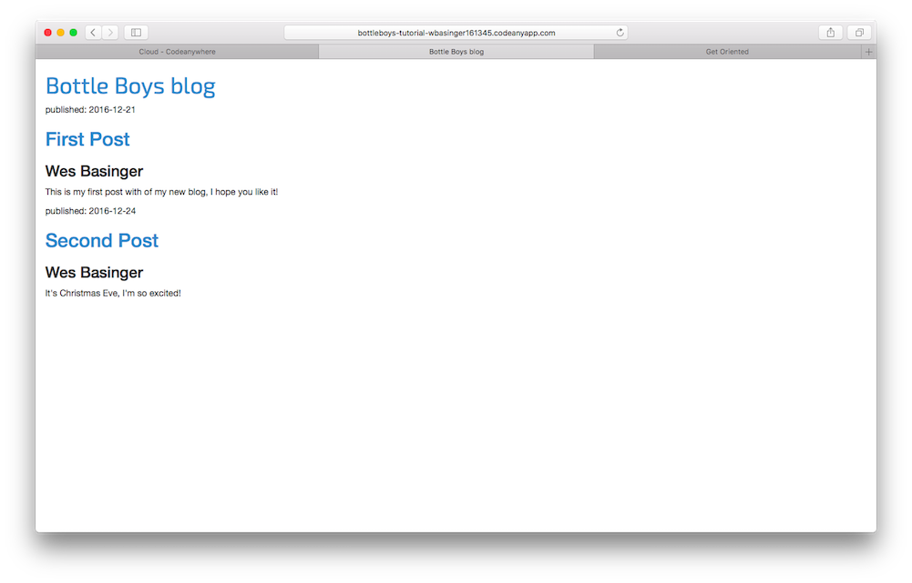

# CSS – make it pretty!

Our blog still looks pretty ugly, right? Time to make it nice! We will use CSS for that.

## What is CSS?

Cascading Style Sheets (CSS) is a language used for describing the look and formatting of a website written in a markup language (like HTML). Treat it as make-up for our web page. ;)

But we don't want to start from scratch again, right? Once more, we'll use something that programmers released on the Internet for free. Reinventing the wheel is no fun, you know.

## Let's use Bootstrap!

Bootstrap is one of the most popular HTML and CSS frameworks for developing beautiful websites: https://getbootstrap.com/

It was written by programmers who worked for Twitter. Now it's developed by volunteers from all over the world!

## Install Bootstrap

To install Bootstrap, you need to add this to your `<head>` in your `.html` file:

views/index.html
```html
<link rel="stylesheet" href="//maxcdn.bootstrapcdn.com/bootstrap/3.2.0/css/bootstrap.min.css">
<link rel="stylesheet" href="//maxcdn.bootstrapcdn.com/bootstrap/3.2.0/css/bootstrap-theme.min.css">
```

This doesn't add any files to your project. It just points to files that exist on the Internet. Just go ahead, open your website and refresh the page. Here it is!


Looking nicer already!  But things are a little too tight to the left, let's fix that with a CSS style sheet of our own.


## Static files in Bottle

Finally we will take a closer look at these things we've been calling __static files__. Static files are all your CSS and images. Their content doesn't depend on the request context and will be the same for every user.


### Where to put static files for Bottle

Basically, we need to set up a special folder to serve static files from.

We do that by creating a folder called `static` inside the blog app:

```
bottleboys
└───/views
└───app.py
└───Procfile
└───db.json
└───/myvenv
└───requirements.txt
└───/static
```

We need to make another route in `app.py` to serve files from the `static` directory.

app.py
```python
from sys import argv
from bottle import route, run, template, static_file # This line is new!!!
from tinydb import TinyDB, Query
import os # This line is new!!!

@route('/')
def index():
  db = TinyDB("db.json")
  posts = db.table("posts")
  return template('index.html', posts=list(posts.all()))

@route('/about')
def about():
  return "This is the about me route."

@route('/blog/<post_number>')
def blog(post_number):
  return "This is blog number " + str(post_number)

################################
#  This route is new           #
################################
@route('/static/<filename>')
def server_static(filename):
    cwd = os.getcwd()
    return static_file(filename, root=cwd + '/static')


run(host="0.0.0.0", port=argv[1], debug=True)
```

## Your first CSS file!

Let's create a CSS file now, to add your own style to your web page. Create a new directory called `css` inside your `static` directory. Then create a new file called `blog.css` inside this `css` directory. Ready?

```
bottleboys
└───/views
└───app.py
└───Procfile
└───db.json
└───/myvenv
└───requirements.txt
└───/static
      └─── blog.css

```

Time to write some CSS! Open up the `static/blog.css` file in your code editor.

We won't be going too deep into customizing and learning about CSS here. It's pretty easy and you can learn it on your own after this workshop. There is a recommendation for a free course to learn more at the end of this page.

But let's do at least a little. Maybe we could change the padding on the left side?
To understand spacing, computers use pixel units.

In your `static/blog.css` file you should add the following code:

static/blog.css
```css
body {
    padding-left: 15px;
}
```

`body` is a CSS Selector. This means we're applying our styles to the `body` element. So this rule will apply to anything within the body tags and will override any Bootstrap stylings from above.

In a CSS file we determine styles for elements in the HTML file. The first way we identify elements is with the element name. You might remember these as tags from the HTML section. Things like `a`, `h1`, and `body` are all examples of element names.
We also identify elements by the attribute `class` or the attribute `id`. Class and id are names you give the element by yourself. Classes define groups of elements, and ids point to specific elements. For example, you could identify the following tag by using the tag name `a`, the class `external_link`, or the id `link_to_wiki_page`:

```html
<a href="https://en.wikipedia.org/wiki/Bottle_(web_framework)" class="external_link" id="link_to_wiki_page">
```

You can read more about [CSS Selectors at w3schools](http://www.w3schools.com/cssref/css_selectors.asp).

Between the `<head>` and `</head>` tags, after the links to the Bootstrap CSS files, add this line to `index.html`:

views/index.html
```html
<link rel="stylesheet" href="/static/blog.css">
```
The browser reads the files in the order they're given, so we need to make sure this is in the right place. Otherwise the code in our file may override code in Bootstrap files.
We just told our template where our CSS file is located.

Your file should now look like this:

views/index.html
```html
<html>
    <head>
        <title>Bottle Boys blog</title>
        <link rel="stylesheet" href="//maxcdn.bootstrapcdn.com/bootstrap/3.2.0/css/bootstrap.min.css">
        <link rel="stylesheet" href="//maxcdn.bootstrapcdn.com/bootstrap/3.2.0/css/bootstrap-theme.min.css">
        <link rel="stylesheet" href="/static/blog.css">
    </head>
    <body>
        <div>
            <h1><a href="/">Bottle Boys blog</a></h1>
        </div>

        % for post in posts:
          <div>
            <p>published: {{post["date"]}}</p>
            <h2>{{post["title"]}}</h2>
            <h3>{{post["author"]}}</h3>
            <p>{{post["body"]}}</p>
          </div>
        % end
    </body>
</html>
```

OK, save the file and refresh the site!


Nice work! Do you notice the increased spacing on the left hand side?  Maybe we can customize the font in our header? Paste this into your `<head>` in `views/index.html` file:

views/index.html
```html
<link href="https://fonts.googleapis.com/css?family=Exo+2" rel="stylesheet">
```

As before, check the order and place before the link to `static/blog.css`. This line will import a font called *Exo 2* from Google Fonts (https://www.google.com/fonts).

Find the `h1 a` declaration block (the code between braces `{` and `}`) in the CSS file `views/blog.css`.  Now add the line `font-family: 'Exo 2';` between the braces (before or after the body declaration), and refresh the page:

views/blog.css
```css
h1 a {
    font-family: 'Exo 2';
}
```



Hopefully you can see the slight change in the font family heading.

As mentioned above, CSS has a concept of classes. These allow you to name a part of the HTML code and apply styles only to this part, without affecting other parts. This can be super helpful! Maybe you have two divs that are doing something different (like your header and your post).  A class can help you make them look different.

Go ahead and name some parts of the HTML code. Add a class called `page-header` to your `div` that contains your header, like this:

views/index.html
```html
<div class="page-header">
    <h1><a href="/">Bottle Boys Blog</a></h1>
</div>
```

And now add a class `post` to your `div` containing a blog post.

views/index.html
```html
<div class="post">
  <p>published: {{post["date"]}}</p>
  <h2><a href="">{{post["title"]}}</a></h2>
  <h3>{{post["author"]}}</h3>
  <p>{{post["body"]}}</p>
</div>
```

Then surround the HTML code which displays the posts with declarations of classes. Replace this:

views/index.html
```html
% for post in posts:
  <div class="post">
    <p>published: {{post["date"]}}</p>
    <h2><a href="">{{post["title"]}}</a></h2>
    <h3>{{post["author"]}}</h3>
    <p>{{post["body"]}}</p>
  </div>
% end
```

in the `view/index.html` with this:

views/index.html
```html
<div class="content container">
  <div class="row">
      <div class="col-md-8">
        % for post in posts:
          <div class="post">
            <p>published: {{post["date"]}}</p>
            <h2><a href="">{{post["title"]}}</a></h2>
            <h3>{{post["author"]}}</h3>
            <p>{{post["body"]}}</p>
          </div>
        % end
      </div>
  </div>
</div>
```
If you got lost, here's how the entire `index.html` should look.

views/index.html
```html
<html>
    <head>
        <title>Bottle Boys blog</title>
        <link rel="stylesheet" href="//maxcdn.bootstrapcdn.com/bootstrap/3.2.0/css/bootstrap.min.css">
        <link rel="stylesheet" href="//maxcdn.bootstrapcdn.com/bootstrap/3.2.0/css/bootstrap-theme.min.css">
        <link href="https://fonts.googleapis.com/css?family=Exo+2" rel="stylesheet">
        <link rel="stylesheet" href="/static/blog.css">
    </head>
    <body>
        <div class="page-header">
            <h1><a href="/">Bottle Boys blog</a></h1>
        </div>
      <div class="content container">
        <div class="row">
            <div class="col-md-8">
              % for post in posts:
                <div class="post">
                  <p>published: {{post["date"]}}</p>
                  <h2><a href="">{{post["title"]}}</a></h2>
                  <h3>{{post["author"]}}</h3>
                  <p>{{post["body"]}}</p>
                </div>
              % end
            </div>
        </div>
      </div>
    </body>
</html>
```

Save that file and let's add some more custom styling with `blog.css`.  When finished, it should contain the following style rules.

static/blog.css
```css
body {
    padding-left: 15px;
}
h1 a {
    font-family: 'Exo 2';
}
.page-header {
  background-color: #033482;
  color: white;
  padding: 20px;
}

.post h2 {
  font-family: 'Exo 2';
}
.content-container {
  background-color: #949fb2;
}
```
Save all files, restart the server and reload the page.


Woohoo! Looks awesome, right?
Look at the code we just pasted to find the places where we added classes in the HTML and used them in the CSS. Where would you make the change if you wanted the date to be turquoise?

Don't be afraid to tinker with this CSS a little bit and try to change some things. Playing with the CSS can help you understand what the different things are doing. If you break something, don't worry – you can always undo it!

We really recommend taking this free online [Codeacademy HTML & CSS course](https://www.codecademy.com/tracks/web). It can help you learn all about making your websites prettier with CSS.

Ready for the next chapter?! :)
