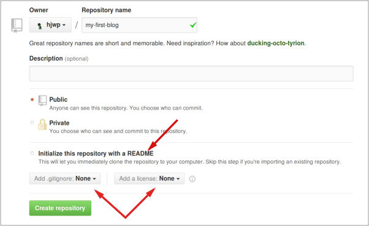

# Deploy!

> **Note** The following chapter can be sometimes a bit hard to get through. Persist and finish it; deployment is an important part of the website development process. This chapter is placed in the middle of the tutorial so that your mentor can help with the slightly trickier process of getting your website online. This means you can still finish the tutorial on your own if you run out of time.

Until now, your website was only available on your computer.  Now you will learn how to deploy it! Deploying is the process of publishing your application on the Internet so people can finally go and see your app. :)

As you learned, a website has to be located on a server. There are a lot of server providers available on the internet. We will use one that has a relatively simple deployment process: [Heroku](https://heroku.com/). Heroku is free for small applications that don't have too many visitors so it'll definitely be enough for you now.

The other external service we'll be using is [GitHub](https://www.github.com), which is a code hosting service. There are others out there, but almost all programmers have a GitHub account these days, and now so will you!

These three places will be important to you.  Your local computer will be the place where you do development and testing.  When you're happy with the changes, you will place a copy of your program on GitHub.  Your website will be on Heroku and you will update it by pushing a new copy of your code.

# Git

> **Note** If you already did the Installation steps, there's no need to do this again – you can skip to the next section and start creating your Git repository.



## Starting our Git repository

Git tracks changes to a particular set of files in what's called a code repository (or "repo" for short). Let's start one for our project. Open up your console and run these commands, in the `bottleboys` directory:

> **Note** Check your current working directory with a `pwd` (Mac OS X/Linux) or `cd` (Windows) command before initializing the repository. You should be in the `bottleboys` folder.

command-line
```
$ git init
Initialized empty Git repository in ~/bottleboys/.git/
$ git config --global user.name "Your Name"
$ git config --global user.email you@example.com
```

Initializing the git repository is something we need to do only once per project (and you won't have to re-enter the username and email again ever).

Git will track changes to all the files and folders in this directory, but there are some files we want it to ignore. We do this by creating a file called `.gitignore` in the base directory. Open up your editor and create a new file with the following contents:

.gitignore
```
*.pyc
*~
__pycache__
myvenv
/static
.DS_Store
db.json
```

And save it as `.gitignore` in the "bottleboys" folder.

> **Note** The dot at the beginning of the file name is important!  If you're having any difficulty creating it (Macs don't like you to create files that begin with a dot via the Finder, for example), then use the "Save As" feature in your editor; it's bulletproof.

It's a good idea to use a `git status` command before `git add` or whenever you find yourself unsure of what has changed. This will help prevent any surprises from happening, such as wrong files being added or committed. The `git status` command returns information about any untracked/modified/staged files, the branch status, and much more. The output should be similar to the following:

command-line
```
$ git status
On branch master

Initial commit

Untracked files:
  (use "git add <file>..." to include in what will be committed)

        .gitignore
        app.py

nothing added to commit but untracked files present (use "git add" to track)
```

And finally we save our changes. Go to your console and run these commands:

command-line
```
$ git add --all .
$ git commit -m "My Bottle Boys app, first commit"
  2 files changed, 14 insertions(+)
  create mode 100644 .gitignore
  create mode 100644 app.py
 ```


## Pushing your code to GitHub

Go to [GitHub.com](https://www.github.com) and sign up for a new, free user account. (If you already did that in the workshop prep, that is great!)

Then, create a new repository, giving it the name "my-first-blog". Leave the "initialize with a README" checkbox unchecked, leave the .gitignore option blank (we've done that manually) and leave the License as None.



> **Note** The name `my-first-blog` is important – you could choose something else, but it's going to occur lots of times in the instructions below, and you'd have to substitute it each time. It's probably easier to just stick with the name `my-first-blog`.

On the next screen, you'll be shown your repo's clone URL. Choose the "HTTPS" version, copy it, and we'll paste it into the terminal shortly:


Now we need to hook up the Git repository on your computer to the one up on GitHub.

Type the following into your console (Replace `<your-github-username>` with the username you entered when you created your GitHub account, but without the angle-brackets):

command-line
```
$ git remote add origin https://github.com/<your-github-username>/my-first-blog.git
$ git push -u origin master
```

Enter your GitHub username and password and you should see something like this:

command-line
```
Username for 'https://github.com': hjwp
Password for 'https://hjwp@github.com':
Counting objects: 6, done.
Writing objects: 100% (6/6), 200 bytes | 0 bytes/s, done.
Total 3 (delta 0), reused 0 (delta 0)
To https://github.com/hjwp/my-first-blog.git
 * [new branch]      master -> master
Branch master set up to track remote branch master from origin.
```

Your code is now on GitHub. Go and check it out!  You'll find it's in fine company – [Django](https://github.com/django/django), the [Bottle Boys Tutorial](https://github.com/wesbasinger/bottleboys), and many other great open source software projects also host their code on GitHub. :)


# Setting up our blog on Heroku

> **Note** You might have already created a Heroku account earlier during the install steps – if so, no need to do it again.




## Pushing our code to Heroku

Make sure you have the Heroku toolbelt installed by typing `heroku --version` into the command line.  Make sure it returns the version and not an error.

Heroku is easy to use, as long as you put a `requirements.txt` file in your working directory, it will recognize that you are trying to run a Python application, it will install all dependencies listed in `requirements.txt`.  You can make the file by running this command.

```
pip freeze > requirements.txt
```

You also need another file called `Procfile` in your working directory with the following contents.  Basically, this file just tells Heroku which file to run for the app and which port to run it on.  You only need one line.

```
web: python ./app.py $PORT
```

Do one more `git add -A .` and `git commit` to make sure that all files are set and ready to go.

While in your `bottleboys` directory, run this command `heroku create <name of your app>`.  I'm going to call my app bottleboys.

Now, run one more command `git push heroku master`.  That command sends your code up to Heroku's cloud.  If you type `heroku open`, you should be able to see your code running.

*If you get an error, try running this command `heroku ps:scale web=1`*

# You are live!

The default page for your site should say "Hello World!", just like it does on your local computer.

You can go back to your local setup. From here you should work on your local setup to make changes. This is a common workflow in web development – make changes locally, push those changes to GitHub, and push your changes down to Heroku. This allows you to work and experiment without breaking your live Web site. Pretty cool, huh?


Give yourself a *HUGE* pat on the back! Server deployments are one of the trickiest parts of web development and it often takes people several days before they get them working. But you've got your site live, on the real Internet, just like that!
