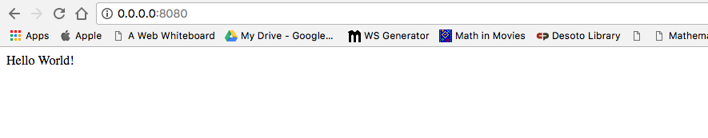

# Your first Bottle project!

Eventually we're going to create a blog, but first, we will create something very simple.  We are going to create a "Hello World" web page.  Working through these instructions will allow us to understand the basic structure of a Bottle application and we will get to see all of the basic routing principles it takes to be successful.

Bottle is a very lightweight framework, most of our code will go into one single file, which we will name `app.py`.  If you go to the [Bottle site](http://www.math.com/students/worksheet/algebra_sp.html) you can see much of what we will cover in this initial section.

Make a file called `app.py` in your `bottleboys` directory.

app.py
```
from sys import argv
from bottle import route, run

@route('/')
def index():
  return "Hello World!"

run(host="0.0.0.0", port=argv[1], debug=True)
```

> Remember to run everything in the virtualenv. If you don't see a prefix `(myvenv)` in your console, you need to activate your virtualenv. We explained how to do that in the __Bottle installation__ chapter in the __Working with virtualenv__ part. Typing `myvenv\Scripts\activate` on Windows or
`source myvenv/bin/activate` on Mac OS X or Linux will do this for you.

And we're done! Time to start the web server and see if our website is working!

## Starting the web server

You need to be in the directory that contains the `app.py` file (the `bottleboys` directory). In the console, we can start the web server by running `python app.py`:

command-line
```
(myvenv) ~/bottleboys$ python app.py 8080
```


Now all you need to do is check that your website is running. Open your browser (Firefox, Chrome, Safari, Internet Explorer or whatever you use) and enter this address:

browser
```
http://0.0.0.0:8080/
```

Congratulations! You've just created your first website and run it using a web server! Isn't that awesome?



While the web server is running, you won't see a new command-line prompt to enter additional commands. The terminal will accept new text but will not execute new commands. This is because the web server continuously runs in order to listen for incoming requests.

> We reviewed how web servers work in the <b>How the Internet works</b> chapter.

To type additional commands while the web server is running, open a new terminal window and activate your virtualenv. To stop the web server, switch back to the window in which it's running and press CTRL+C - Control and C buttons together (on Windows, you might have to press Ctrl+Break).

Ready for the next step? It's time to create some content!
